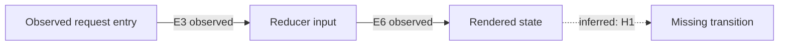
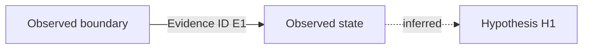

# Systematic Debugging

## Overview

Random fixes waste time and create new bugs. Quick patches mask underlying issues.

**Core principle:** ALWAYS find root cause before attempting fixes. Symptom fixes are failure.

**Violating the letter of this process is violating the spirit of debugging.**

## The Iron Law

```
NO FIXES WITHOUT ROOT CAUSE INVESTIGATION FIRST
```

If you haven't completed Phase 1, you cannot propose fixes.

## When to Use

Use for ANY technical issue:
- Test failures
- Bugs in production
- Unexpected behavior
- Performance problems
- Build failures
- Integration issues

**Use this ESPECIALLY when:**
- Under time pressure (emergencies make guessing tempting)
- "Just one quick fix" seems obvious
- You've already tried multiple fixes
- Previous fix didn't work
- You don't fully understand the issue

**Don't skip when:**
- Issue seems simple (simple bugs have root causes too)
- You're in a hurry (rushing guarantees rework)
- Manager wants it fixed NOW (systematic is faster than thrashing)

## The Four Phases

You MUST complete each phase before proceeding to the next.

## Debug Checkpoint Protocol

Use a Debug Checkpoint when an investigation spans multiple turns, crosses a
context compaction or fresh-worker handoff, or shows a reread loop. A short one-turn investigation may omit it. Once activated, update it after every
decisive experiment, when a phase closes, and before handing work to a fresh
context. The checkpoint is the source of truth for recovery; it is not a
replacement for the four phases or executable verification.

### Track state and phase gates

Split materially different symptoms or causal questions into independent
tracks. Do not keep a confirmed sibling open just because another track is
unresolved. Use these exact Track statuses:

- `OPEN` — the track still needs evidence or a replacement hypothesis.
- `CONFIRMED` — the root cause or behavior is established; freeze the track
  unless new evidence explicitly invalidates the decision.
- `BLOCKED` — a named prerequisite is unavailable; record the smallest input
  needed to continue and stop broad rereads.
- `HANDED_OFF` — the evidence is complete for the next Proposal or
  implementation mode.

Use these exact Hypothesis statuses independently from track status:
`PROPOSED`, `TESTING`, `CONFIRMED`, and `REFUTED`. A `REFUTED` hypothesis does
not close its track; record the refuting observation before proposing a new
hypothesis. Each `OPEN` track has exactly one next decisive experiment.

Exit a phase per track, not globally:

| Phase | Exit gate |
|---|---|
| Phase 1 | Reproduction is reproducible or explicitly `BLOCKED`, the failing boundary is narrowed, and the evidence is recorded. |
| Phase 2 | A working-vs-broken comparison is recorded with one prioritized difference. |
| Phase 3 | One hypothesis and one minimal decisive experiment are stated. |
| Phase 4 | A failing test exists before an implementation fix, followed by verification evidence after the fix. |

When runtime access, credentials, or another prerequisite is missing, mark the
track `BLOCKED`, name the exact prerequisite and smallest continuation input,
and do not keep rereading source files while waiting.

### Evidence ledger

Keep facts, inferences, hypotheses, and decisions separate. Every Evidence ID
must be stable within the checkpoint and include:

- type: `source`, `test`, `runtime`, `log`, `image`, or `diagram`;
- source path or command, plus a precise symbol/line, output, boundary, route,
  or capture anchor;
- the observed fact, the implication it supports, and confidence or a
  limitation/reproducibility note.

Prefer inspectable excerpts over summaries such as “checked” or “works”:

| ID | Type | Source or command | Precise anchor | Observation | Implication | Confidence / limitation |
|---|---|---|---|---|---|---|
| E1 | source | `src/mapper.ts` | `projectRecord:42-49` | returned object omits `status` | explains the projection mismatch | high; exact source slice |
| E2 | test | `npm test -- mapper.test.ts` | failing assertion `status` | reproduction fails deterministically | confirms the symptom | rerunnable command |
| E3 | runtime | probe + environment | handler entry/exit | value enters as `pending`, exits as `undefined` | narrows the boundary | include artifact or output |
| E4 | log | service log query | request ID and timestamp | downstream receives no transition event | identifies the missing handoff | timing window is a limitation |
| E5 | image | `artifacts/status-mismatch.png` | route/state/capture time | badge remains stale after refresh | supports a visible mismatch | cannot prove persistence or backend timing |
| E6 | diagram | Mermaid flow/data-flow diagram | observed edge `API -> reducer` | boundary is labeled `E3` | explains the path under test | inferred edges are labeled |

### Visual and diagram evidence

Use images, screenshots, ASCII diagrams, Mermaid `flowchart`/state diagrams,
data-flow diagrams, and comparison tables when they make a boundary or state
transition easier to inspect. For each image or diagram record its caption,
source or capture context, visible/observed facts, expected-versus-actual
interpretation when relevant, and uncertainty or limitations. Label edges and
nodes as observed, inferred, or proposed, and link observed edges to their
Evidence ID. Visual evidence is illustrative or evidentiary; it does not replace executable verification.

Example:



```text
[source E1] -> [test E2] -> [runtime E3] -> [log E4]
                                  |
                                  v
                         [image E5: visible only]
```

The screenshot can show what was visible at a route and time; it cannot prove
backend persistence, hidden state, or timing outside the capture. A diagram
can explain a proposed path, but its inferred edge is not a measured fact.

### Canonical checkpoint shape

Use this compact Markdown shape when the protocol is active:

```md
## Debug Checkpoint: <scope>

### Scope and Track Map
| Track | Track status | Current phase | Open question | Next decisive experiment |
|---|---|---|---|---|
| T1 | OPEN | Phase 2 | <question> | <one next decisive experiment> |

### Current Phase and Exit Criteria
<per-track gate and missing evidence>

### Facts and Decisions
- F1 [observed]: <fact with Evidence IDs>
- I1 [inferred]: <inference, not a fact>
- D1 [decision]: <closed branch or handoff>

### Evidence Ledger
| ID | Type | Source or command | Precise anchor | Observation | Implication | Confidence / limitation |
|---|---|---|---|---|---|---|

### Working-vs-Broken Comparison
| Dimension | Working | Broken | Evidence IDs |
|---|---|---|---|

### Hypotheses
- H1 [TESTING]: <one hypothesis>; next decisive experiment: <one experiment>
- H2 [REFUTED]: <hypothesis>; refuting Evidence ID: <ID>

### Verification
| Check | Outcome | Command / environment | Evidence |
|---|---|---|---|

### Visual Analysis

<capture context, observed facts, inference, expected/actual, limitations>



### Reread Budget and No-Progress Log
- Reread: <path/symbol> — reason: changed revision | new symbol/line range | hypothesis slice
- No-progress action 1: <repeated inspection>
- No-progress action 2: <repeated inspection>
- Escalation: probe | fresh context | BLOCKED — <reason>

### Handoff / Next Action
<one next action, preserved paths/Evidence IDs, and whether implementation
requires leaving read-only explore mode>
```

### Context recovery and bounded rereads

Before compaction or a fresh-worker handoff, write/update the checkpoint and
preserve exact paths, symbols, commands, output anchors, image references, and
Evidence IDs. A recovering agent reads the checkpoint first, restates track
statuses and preserved conclusions, and performs only the recorded next
decisive experiment or a narrowly justified new read. It must not restart a
broad repository scan by default.

Record why any previously inspected file is being reread. It is allowed only
when the source has a changed revision, the new slice has a new symbol/line
range, or the active hypothesis requires a new hypothesis slice. Use platform-
safe path handling such as `path.join()` and `path.resolve()` for generated
references; preserve a Windows display path such as
`C:\\workspace\\debug-checkpoints\\incident\\checkpoint.md` instead of
assuming POSIX separators.

After two consecutive investigation actions that add no new evidence, append
both actions to the No-Progress Log, checkpoint immediately, and choose one
escalation: run a minimal runtime probe/instrumentation, start a fresh context
with this checkpoint, or mark the track `BLOCKED` and request the missing input.
Do not silently continue the same broad loop.

### Phase 1: Root Cause Investigation

**BEFORE attempting ANY fix:**

1. **Read Error Messages Carefully**
   - Don't skip past errors or warnings
   - They often contain the exact solution
   - Read stack traces completely
   - Note line numbers, file paths, error codes

2. **Reproduce Consistently**
   - Can you trigger it reliably?
   - What are the exact steps?
   - Does it happen every time?
   - If not reproducible → gather more data, don't guess

3. **Check Recent Changes**
   - What changed that could cause this?
   - Git diff, recent commits
   - New dependencies, config changes
   - Environmental differences

4. **Gather Evidence in Multi-Component Systems**

   **WHEN system has multiple components (CI → build → signing, API → service → database):**

   **BEFORE proposing fixes, add diagnostic instrumentation:**
   ```
   For EACH component boundary:
     - Log what data enters component
     - Log what data exits component
     - Verify environment/config propagation
     - Check state at each layer

   Run once to gather evidence showing WHERE it breaks
   THEN analyze evidence to identify failing component
   THEN investigate that specific component
   ```

   **Example (multi-layer system):**
   ```bash
   # Layer 1: Workflow
   echo "=== Secrets available in workflow: ==="
   echo "IDENTITY: ${IDENTITY:+SET}${IDENTITY:-UNSET}"

   # Layer 2: Build script
   echo "=== Env vars in build script: ==="
   env | grep IDENTITY || echo "IDENTITY not in environment"

   # Layer 3: Signing script
   echo "=== Keychain state: ==="
   security list-keychains
   security find-identity -v

   # Layer 4: Actual signing
   codesign --sign "$IDENTITY" --verbose=4 "$APP"
   ```

   **This reveals:** Which layer fails (secrets → workflow ✓, workflow → build ✗)

5. **Trace Data Flow**

   **WHEN error is deep in call stack:**

   See `root-cause-tracing.md` in this directory for the complete backward tracing technique.

   **Quick version:**
   - Where does bad value originate?
   - What called this with bad value?
   - Keep tracing up until you find the source
   - Fix at source, not at symptom

### Phase 2: Pattern Analysis

**Find the pattern before fixing:**

1. **Find Working Examples**
   - Locate similar working code in same codebase
   - What works that's similar to what's broken?

2. **Compare Against References**
   - If implementing pattern, read reference implementation COMPLETELY
   - Don't skim - read every line
   - Understand the pattern fully before applying

3. **Identify Differences**
   - What's different between working and broken?
   - List every difference, however small
   - Don't assume "that can't matter"

4. **Understand Dependencies**
   - What other components does this need?
   - What settings, config, environment?
   - What assumptions does it make?

### Phase 3: Hypothesis and Testing

**Scientific method:**

1. **Form Single Hypothesis**
   - State clearly: "I think X is the root cause because Y"
   - Write it down
   - Be specific, not vague

2. **Test Minimally**
   - Make the SMALLEST possible change to test hypothesis
   - One variable at a time
   - Don't fix multiple things at once

3. **Verify Before Continuing**
   - Did it work? Yes → Phase 4
   - Didn't work? Form NEW hypothesis
   - DON'T add more fixes on top

4. **When You Don't Know**
   - Say "I don't understand X"
   - Don't pretend to know
   - Ask for help
   - Research more

### Phase 4: Implementation

**Fix the root cause, not the symptom:**

1. **Create Failing Test Case**
   - Simplest possible reproduction
   - Automated test if possible
   - One-off test script if no framework
   - MUST have before fixing
   - Use the `superpowers:test-driven-development` skill for writing proper failing tests

2. **Implement Single Fix**
   - Address the root cause identified
   - ONE change at a time
   - No "while I'm here" improvements
   - No bundled refactoring

3. **Verify Fix**
   - Test passes now?
   - No other tests broken?
   - Issue actually resolved?

4. **If Fix Doesn't Work**
   - STOP
   - Count: How many fixes have you tried?
   - If < 3: Return to Phase 1, re-analyze with new information
   - **If ≥ 3: STOP and question the architecture (step 5 below)**
   - DON'T attempt Fix #4 without architectural discussion

5. **If 3+ Fixes Failed: Question Architecture**

   **Pattern indicating architectural problem:**
   - Each fix reveals new shared state/coupling/problem in different place
   - Fixes require "massive refactoring" to implement
   - Each fix creates new symptoms elsewhere

   **STOP and question fundamentals:**
   - Is this pattern fundamentally sound?
   - Are we "sticking with it through sheer inertia"?
   - Should we refactor architecture vs. continue fixing symptoms?

   **Discuss with your human partner before attempting more fixes**

   This is NOT a failed hypothesis - this is a wrong architecture.

## Red Flags - STOP and Follow Process

If you catch yourself thinking:
- "Quick fix for now, investigate later"
- "Just try changing X and see if it works"
- "Add multiple changes, run tests"
- "Skip the test, I'll manually verify"
- "It's probably X, let me fix that"
- "I don't fully understand but this might work"
- "Pattern says X but I'll adapt it differently"
- "Here are the main problems: [lists fixes without investigation]"
- Proposing solutions before tracing data flow
- **"One more fix attempt" (when already tried 2+)**
- **Each fix reveals new problem in different place**

**ALL of these mean: STOP. Return to Phase 1.**

**If 3+ fixes failed:** Question the architecture (see Phase 4.5)

## your human partner's Signals You're Doing It Wrong

**Watch for these redirections:**
- "Is that not happening?" - You assumed without verifying
- "Will it show us...?" - You should have added evidence gathering
- "Stop guessing" - You're proposing fixes without understanding
- "Ultrathink this" - Question fundamentals, not just symptoms
- "We're stuck?" (frustrated) - Your approach isn't working

**When you see these:** STOP. Return to Phase 1.

## Common Rationalizations

| Excuse | Reality |
|--------|---------|
| "Issue is simple, don't need process" | Simple issues have root causes too. Process is fast for simple bugs. |
| "Emergency, no time for process" | Systematic debugging is FASTER than guess-and-check thrashing. |
| "Just try this first, then investigate" | First fix sets the pattern. Do it right from the start. |
| "I'll write test after confirming fix works" | Untested fixes don't stick. Test first proves it. |
| "Multiple fixes at once saves time" | Can't isolate what worked. Causes new bugs. |
| "Reference too long, I'll adapt the pattern" | Partial understanding guarantees bugs. Read it completely. |
| "I see the problem, let me fix it" | Seeing symptoms ≠ understanding root cause. |
| "One more fix attempt" (after 2+ failures) | 3+ failures = architectural problem. Question pattern, don't fix again. |

## Quick Reference

| Phase | Key Activities | Success Criteria |
|-------|---------------|------------------|
| **1. Root Cause** | Read errors, reproduce, check changes, gather evidence | Understand WHAT and WHY |
| **2. Pattern** | Find working examples, compare | Identify differences |
| **3. Hypothesis** | Form theory, test minimally | Confirmed or new hypothesis |
| **4. Implementation** | Create test, fix, verify | Bug resolved, tests pass |

## When Process Reveals "No Root Cause"

If systematic investigation reveals issue is truly environmental, timing-dependent, or external:

1. You've completed the process
2. Document what you investigated
3. Implement appropriate handling (retry, timeout, error message)
4. Add monitoring/logging for future investigation

**But:** 95% of "no root cause" cases are incomplete investigation.

## Supporting Techniques

These techniques are part of systematic debugging and available in this directory:

- **`root-cause-tracing.md`** - Trace bugs backward through call stack to find original trigger
- **`defense-in-depth.md`** - Add validation at multiple layers after finding root cause
- **`condition-based-waiting.md`** - Replace arbitrary timeouts with condition polling

**Related skills:**
- **superpowers:test-driven-development** - For creating failing test case (Phase 4, Step 1)
- **superpowers:verification-before-completion** - Verify fix worked before claiming success
