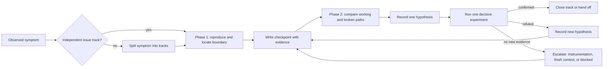
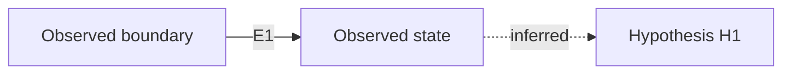

## Context

The current debugging skill has a strong root-cause mandate and four phases, while explore mode intentionally avoids a fixed workflow. That combination works for short investigations but fails when a read-only investigation spans multiple turns or context compactions: the agent retains intentions such as “inspect the next layer” more reliably than the evidence that already closed a branch. The fix is a lightweight, host-neutral checkpoint protocol that makes investigation state explicit without adding a product database, CLI state machine, or implementation work to explore mode.

The user specifically needs checkpoints to preserve more than a short summary. A checkpoint must be able to carry exact code anchors and excerpts, command and runtime evidence, screenshots, image observations, uncertainty, and diagrams that explain control flow, data flow, state transitions, or ownership. Visual material is evidence and explanation; it is not a substitute for executable verification.

## Current system

The static `skills/systematic-debugging/SKILL.md` defines the four debugging phases, the single-hypothesis rule, multi-component boundary tracing, and the rule to return to Phase 1 after failed fixes. It does not define a durable state format, per-symptom branches, phase exit criteria, or compaction recovery.

The generated `superpowers-explore` skill and `/sp:explore` command are implemented together in `src/core/templates/workflows/explore.ts`. Explore mode permits codebase investigation and visualization but deliberately has no mandatory sequence or output. `skills/using-superpowers/SKILL.md` already treats repeated broad rereads and context churn as Proposal-boundary signals for implementation work, but does not apply the same signal while diagnosis is still read-only.

### Relationship to existing tech

| Existing capability | Relation | Pointer | Note |
|---|---|---|---|
| Systematic debugging phases | extend | `skills/systematic-debugging/SKILL.md` — `## The Four Phases` | Preserve the root-cause order while adding per-track gates and recovery. |
| Explore mode | extend | `src/core/templates/workflows/explore.ts` — `getExploreSkillTemplate` and `getSpExploreCommandTemplate` | Preserve thinking-only behavior; add bounded investigation and checkpoint guidance. |
| Work-mode selection | extend | `skills/using-superpowers/SKILL.md` — `Promote before further edits` and `Context churn` | Treat repeated diagnostic rereads as a checkpoint/fresh-context signal before more inspection. |
| Skill contract testing | reuse | `test/core/using-superpowers-guidance.test.ts`, `test/core/templates/skill-templates-parity.test.ts` | Add focused static assertions and update generated-content parity intentionally. |
| Existing debugging pressure scenarios | reuse | `skills/systematic-debugging/test-pressure-*.md` | Add a compaction/no-progress scenario rather than replacing the existing anti-shortcut coverage. |



## Goals / Non-Goals

**Goals:**

- Make investigation state recoverable after context compaction or a fresh worker handoff.
- Track each independent symptom or hypothesis as its own state machine instead of keeping one global Phase 1/2 status.
- Preserve high-value evidence: source anchors, excerpts, commands, outputs, logs, runtime observations, screenshots, image analysis, and diagrams.
- Make phase completion and track closure observable, bounded, and resistant to broad reread loops.
- Keep visual analysis useful and inspectable: every image or diagram gets a caption, source, observed facts, implication, and uncertainty/limitation note.
- Keep explore mode read-only and compatible with existing Proposal → Review → Apply boundaries.

**Non-Goals:**

- No product runtime, API, database, or application-state changes.
- No mandatory new CLI command, database, or host-specific persistence service.
- No automatic image generation, OCR, diagram rendering, or claim that a screenshot proves a runnable journey.
- No replacement of the existing four debugging phases or TDD/verification requirements.
- No requirement that every short investigation create a separate file; a structured response checkpoint is sufficient when the work will not cross a context boundary.

## Decisions

### 1. Checkpoint persistence boundary

**Problem:** The protocol must survive compaction without creating a new runtime subsystem or forcing artifacts on trivial investigations.

| Option | Cross-host portability | Recovery strength | Process overhead |
|---|---|---|---|
| A. Add more prose reminders only | High | Low; state remains in lossy conversation context | Low |
| B. Use a structured Markdown checkpoint in the response, with an optional identical workspace handoff file | High; works in Codex, Claude, OpenCode, and manual sessions | High; explicit evidence and next action survive a fresh context | Medium |
| C. Add a CLI/host-managed checkpoint store | Potentially uneven across hosts | Highest if every host integrates it | High; new state, schema, and migration surface |

**Choice:** B. Markdown is expressive enough for code excerpts, tables, image references, Mermaid, and ASCII diagrams; it can be emitted in conversation and saved when a long-running handoff needs filesystem durability. A CLI store is intentionally deferred until real usage demonstrates that text handoffs are insufficient.

**Trade-offs / cost:** Agents must follow a structured format and may need to duplicate the block into a file for multi-session work. This is preferable to inventing persistence infrastructure for a process-only change.

### 2. Visual and code-evidence representation

**Problem:** A compact checkpoint must preserve detailed evidence without turning every investigation into a binary log or an unreadable transcript.

| Option | Evidence fidelity | Human inspectability | Tool dependence |
|---|---|---|---|
| A. Plain prose summary | Low; source and visual claims lose anchors | High for short notes | Low |
| B. Evidence ledger plus Markdown visuals | High; each item has ID, source, observation, implication, and confidence | High; tables, Mermaid, ASCII, and image captions remain reviewable | Low; standard Markdown only |
| C. JSON event log with external visual artifacts | High for machines | Medium; visual analysis is awkward and harder to scan | High; requires schema/tooling |

**Choice:** B. Use a small ledger with typed evidence IDs and Markdown-native visual sections. The protocol distinguishes observed facts from inferences and hypotheses, and it records image limitations so a diagram or screenshot cannot silently become proof of behavior.

**Trade-offs / cost:** Markdown is less machine-parseable than JSON, so the initial contract uses stable headings and status labels rather than promising automated ingestion. The evidence ledger can later be parsed without changing its meaning.

### 3. Bounded recovery and escalation

**Problem:** Recovery must stop context loops without forcing every short investigation into a durable artifact or adding host-specific token telemetry.

| Option | Stop-loop precision | Cross-host portability | Operational cost |
|---|---|---|---|
| A. Fixed timer or fixed number of reads | Low; can stop during useful work or allow repeated unproductive hypotheses | High | Low |
| B. Per-track activation triggers plus two-action no-progress escalation | High; ties recovery to evidence and the active hypothesis | High; uses Markdown and ordinary agent behavior | Medium |
| C. Host-managed token telemetry and automatic worker rotation | Potentially highest | Uneven until every host supports the same signal | High; adds orchestration and integration surface |

**Choice:** B. Activate only for multi-turn/compaction/handoff/reread-loop investigations, checkpoint after meaningful transitions, and escalate after two no-progress actions. This provides a concrete stop rule without making short investigations noisy or depending on host-specific token APIs.

**Trade-offs / cost:** The agent must judge whether an action added evidence, so the protocol is not a mathematically exact token budget. The checkpoint ledger makes that judgment inspectable and gives a future host-managed implementation a stable input.

Use a per-track recovery rule rather than a global timer. The protocol is activated only for a multi-turn investigation, a context-compaction/fresh-worker handoff, or a detected reread loop. Once activated, a track must checkpoint before a context handoff, after a decisive experiment, and when a phase closes. It must not reread a previously inspected file unless the checkpoint names a changed revision, a new symbol/line range, or a hypothesis that requires a new slice. Two consecutive investigation actions that add no new evidence trigger escalation: use a minimal runtime probe/instrumentation, start a fresh context with the checkpoint, or mark the track `BLOCKED` and request the missing input. The agent must not silently continue broad exploration, and a short one-turn investigation is not forced to create a checkpoint.

### 4. Evidence versus verification

Code excerpts, logs, screenshots, and diagrams explain where a failure appears and what the agent observed. They do not replace a failing test, a focused runtime reproduction, or applicable E2E verification. Checkpoints therefore include both an `Evidence` ledger and a `Verification` section, with explicit `passed`, `failed`, `blocked`, or `not applicable` outcomes where a check was attempted.

## Contracts

### API / CLI

N/A — no API or CLI surface change.

### Checkpoint document

A Debug Checkpoint SHALL contain these stable sections:

- `Scope and Track Map`
- `Current Phase and Exit Criteria`
- `Facts and Decisions`
- `Evidence Ledger`
- `Working-vs-Broken Comparison` when Phase 2 applies
- `Hypotheses` with exactly one `next decisive experiment` per open track
- `Verification`
- `Visual Analysis` when images or diagrams are used
- `Reread Budget and No-Progress Log`
- `Handoff / Next Action`

Each evidence item has an ID, type, source or command, precise anchor, observation, implication, and confidence/limitation. Supported types are `source`, `test`, `runtime`, `log`, `image`, and `diagram`.

Track statuses are `OPEN`, `CONFIRMED`, `BLOCKED`, and `HANDED_OFF`. Hypothesis statuses are `PROPOSED`, `TESTING`, `CONFIRMED`, and `REFUTED`. Refuting a hypothesis does not close its track: the track remains `OPEN` until a replacement hypothesis is confirmed, the track is blocked, or it is handed off. A confirmed track is frozen unless new evidence explicitly invalidates the decision.

### Checkpoint skeleton

The following Markdown skeleton is the canonical shape. The angle-bracket values are filled with concrete evidence in a real checkpoint.

```md
## Debug Checkpoint: <scope>

### Scope and Track Map
| Track | Track status | Current phase | Open question | Next decisive experiment |
|---|---|---|---|---|
| T1 | OPEN | Phase 2 | <question> | <one experiment> |

### Current Phase and Exit Criteria
<per-track exit condition and the evidence still missing>

### Facts and Decisions
- F1 [observed]: <fact with evidence IDs>
- D1 [decision]: <closed branch or handoff decision>

### Evidence Ledger
| ID | Type | Source or command | Precise anchor | Observation | Implication | Confidence / limitation |
|---|---|---|---|---|---|---|
| E1 | source | <path> | <symbol:line> | <observed code> | <what it establishes> | <confidence> |
| E2 | test | <command> | <test/output> | <result> | <what it establishes> | <reproducibility> |
| E3 | runtime | <command/environment> | <boundary/output/artifact> | <entry/exit observation> | <what it establishes> | <reproducibility/limitation> |
| E4 | image | <renderable path> | <route/state/capture> | <visible fact> | <supported inference> | <what image cannot prove> |

### Working-vs-Broken Comparison
| Dimension | Working | Broken | Evidence IDs |
|---|---|---|---|

### Hypotheses
- H1 [TESTING]: <one hypothesis>; evidence: E1; next experiment: <one experiment>
- H2 [REFUTED]: <refuted hypothesis>; refuting evidence: E2

### Verification
| Check | Outcome | Command / environment | Evidence |
|---|---|---|---|

### Visual Analysis


<!-- diagram evidence ID -->


Diagram labels distinguish observed edges from inferred edges and link observed nodes/edges to Evidence IDs.

### Reread Budget and No-Progress Log
- Reread: <path/symbol> — reason: <changed revision | new anchor | hypothesis slice>
- No-progress action 1: <what was repeated>
- Escalation: <probe | fresh context | BLOCKED>, reason: <why>

### Handoff / Next Action
<single next action, preserved paths/IDs, and whether implementation requires leaving explore mode>
```

The skeleton is normative for section and field names; the example values are illustrative.

### States

N/A — no application state machine changes. The checkpoint statuses are documentation states only.

### Errors

N/A — no application error codes change.

## Attachments

No change-local attachments are required. Checkpoints may reference project-local screenshots or other files using platform-safe paths; visual content remains illustrative/evidentiary unless a verification section records an executable check.

## Risks / Trade-offs

- [Checkpoint format becomes too long] → Require IDs and concise observations, allow detail in linked evidence files, and keep only one next experiment per open track.
- [Agents treat diagrams as proof] → Label diagrams as observed, inferred, or proposed and keep executable verification separate.
- [Agents create checkpoints for trivial work] → Trigger the protocol only for multi-turn investigation, context compaction, fresh-worker handoff, or detected reread loops.
- [Markdown is not automatically persisted] → Emit the checkpoint in the response and save an identical handoff file when the investigation will cross turns or workers.
- [Generated and static guidance drift] → Add source-level contract tests and update parity hashes only after the intended content is verified.

## Migration Plan

1. Add the checkpoint contract and recovery rules to `skills/systematic-debugging/SKILL.md`.
2. Add exploration-specific checkpoint guidance and visual evidence rules to `src/core/templates/workflows/explore.ts`.
3. Add the diagnostic context-churn promotion signal to `skills/using-superpowers/SKILL.md`.
4. Add pressure and static contract tests, then update generated parity expectations for the intentional explore-template change.
5. Existing sessions need no migration; on the next context boundary, an agent can create a checkpoint from its current facts and continue using the new protocol.

Rollback is documentation-only: revert the three guidance changes and their contract tests/parity updates. No user or product data migration is required.

## Open Questions

None for this change. A future change may add CLI-managed checkpoint files if response-plus-Markdown handoffs prove insufficient across hosts.
