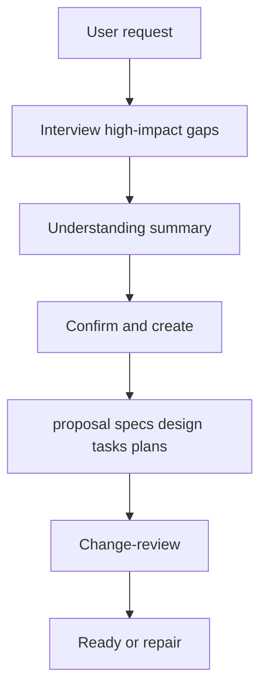

## Context

Propose already has a pre-confirmation interview gate. Design already requires Current system, Contracts, Invariants, user-real vs agent-owned decisions, and implementable detail (mapping rules, fail-closed, worked example). Change-review already flags principle-only design as WARNING.

Those rules still start from what the user said or confirmed. They do not require the agent to derive the product and technical details that follow from that direction but were never mentioned. This change is convention-only: instruction text, template comments, review rubric, and string-contract tests. No new artifact, no `validate` parser, no `applyRequires` change.

User-confirmed decisions from the Propose interview are recorded in Decisions below. Agent-owned mapping for instruction insertion and the scan itself are also below.

## Current system

Propose (`src/core/templates/workflows/propose.ts`, constant `PROPOSE_INTERVIEW_GUIDANCE`) runs a read-only preflight, asks only unresolved high-impact product or technical questions, then presents a summary that separates confirmed decisions from agent-owned implementation assumptions. After confirm-and-create it generates schema artifacts in dependency order. Confirmed product decisions go to `proposal.md`. High-impact technical decisions go to `design.md`. Routine local details are agent-owned, but nothing tells the agent to systematically derive unmentioned implications.

The spec-driven design artifact is a Markdown file. The skeleton lives in `schemas/spec-driven/templates/design.md`. The authoring rules live in `schemas/spec-driven/schema.yaml` under `id: design` `instruction`. Schema-init copies a parallel skeleton from the `case 'design':` branch in `src/commands/schema.ts`. Required top-level headings today are Context, Current system (with Relationship), Goals / Non-Goals, Decisions, Contracts, Invariants, plus Risks, Migration, Open Questions. Authors may add extra subsections. Review must not invent extra required headings such as Target flow.

Change-review (`src/core/templates/workflows/change-review.ts`, generated skill/command, and repo projections such as `.vscode/important_skills/change-review/SKILL.md`) judges Completeness, Clarity, Coherence, and Implementability. Design convention checks already cover Current system onboarding, Contracts, Invariants, user-real choice labels, and implementable detail. A principle-only behavioral design is WARNING; missing `## Invariants` is BLOCKER. There is no scan for unmentioned implications, and no rule that such a gap must stay WARNING-only.



The gap is the missing derive-and-record step around `summary` and `design`: implied empty/deny, actor/ownership, lifecycle, compatibility, contracts, and product forks never get forced into `design.md` or (when observable) delta specs.

### Relationship to existing tech

| Existing capability | Relation | Pointer | Note |
|---|---|---|---|
| Propose interview gate | extend | `src/core/templates/workflows/propose.ts` `PROPOSE_INTERVIEW_GUIDANCE` | Keep one-question interview; add scan + summary list + post-confirm write |
| Design template | extend | `schemas/spec-driven/templates/design.md` `## Decisions` | Comments + optional `### Derived implications`; no new required H1/H2 |
| Design instruction | extend | `schemas/spec-driven/schema.yaml` `- id: design` `instruction:` | Closed scan, labeling, spec trace, no extra required heading |
| Schema-init design fallback | extend | `src/commands/schema.ts` `case 'design':` | Keep heading order; same scan comments as package template |
| Change-review rubric | extend | `src/core/templates/workflows/change-review.ts` Design convention checks | Missing scan → WARNING; never BLOCKER solely for derived gap |
| Design convention tests | extend | `test/core/templates/design-conventions.test.ts` | Add string anchors; do not remove Current system / Invariants / user-choice asserts |
| Implementable-detail rule | reuse | `schemas/spec-driven/schema.yaml` design instruction “Principle-only prose is not enough” | Scan is additional; mapping rules and worked examples stay required |
| CLI validate | boundary | `superpowers validate` | Structural only; must not parse scan rows |

## Goals / Non-Goals

**Goals:**

- Force Propose to derive implementation-critical details the user did not mention, from the confirmed product/design direction.
- Record those details in existing `design.md` headings and trace observable ones into delta specs.
- Have change-review check the closed scan without blocking readiness on derived gaps.
- Keep interview short: write non-boundary derivations; ask only at real product or trust boundaries.

**Non-Goals:**

- New required top-level `design.md` heading.
- CLI `validate` content parsing of scan rows.
- New schema artifact or `applyRequires` change.
- Onboard long-form rewrite.
- Extra interview questions for empty states, fail-closed paths, or other non-boundary implications.
- Escalating derived-implication gaps to BLOCKER.

## Decisions

### 1. Where derived details live

**Problem:** Should derived unmentioned details get a new `design.md` heading, stay in existing headings, and/or become spec requirements?

**User selection:** existing-headings-plus-spec-trace — write into existing `design.md` headings (optional `Derived implications` subsection); observable behavior must also sync to the delta spec.

| Option | Discoverability | Heading freeze | Spec truth |
|---|---|---|---|
| A. Existing headings + spec trace | Readers use known sections | Preserved | Observable behavior specified |
| B. Design.md existing headings only | Same | Preserved | Implementers may miss user-visible rules |
| C. New required `## Derived implications` | Highest | Breaks current freeze | Depends |

**Choice:** A.

**Trade-offs / cost:** Review must check design and specs together for observable derived rules. Authors must not hide user-visible behavior only in design prose.

### 2. When to derive vs interview

**Problem:** When should the agent write a derived detail versus ask the user?

**User selection:** derive-unless-boundary — write when it does not change confirmed direction and does not cross a trust boundary; interview only for direction reversal or security/data/billing/public-contract.

| Option | Interview load | Product risk |
|---|---|---|
| A. Derive unless boundary | Low | Residual wrong assumption unless summary is corrected |
| B. Interview every product-facing derivation | High | Lowest silent product lock-in |
| C. Always derive silently | Lowest | Highest product-risk; summary may hide assumptions |

**Choice:** A.

**Trade-offs / cost:** The final understanding summary must show compact derived assumptions so the user can edit them before create.

### 3. How complete the derivation must be

**Problem:** How does review know the agent derived enough?

**User selection:** closed-scan-checklist — closed dimension list; write a rule or short N/A; no new top-level heading.

| Option | Repeatability | Ceremony |
|---|---|---|
| A. Closed scan checklist | High | Must visit six dimensions |
| B. Open-ended judgment | Low | Easy to skip |
| C. Required filled table as a heading | Highest | Extra heading + ritual N/A |

**Choice:** A.

**Trade-offs / cost:** Small helper changes need a one-line whole-scan N/A so six empty rows are not forced.

### 4. Review severity for missing derived details

**Problem:** Does a missing scan dimension block proposal readiness?

**User selection:** derived-gaps-warning-only — derived omissions are always WARNING; they never block readiness.

| Option | Ready gate | Rework pressure |
|---|---|---|
| A. WARNING, escalate to BLOCKER when implementer must guess user-visible/trust/contract rules | Partial block | Stronger |
| B. Missing dimension always BLOCKER | Always blocks | Highest ceremony |
| C. Derived gaps WARNING only | Never blocks on this class | Agents may leave WARNINGs visible |

**Choice:** C.

**Trade-offs / cost:** A hole that would make Apply guess still ships as ready-with-WARNING. Coordinators SHOULD repair those WARNINGs but MUST NOT re-dispatch proposal review solely for them.

### 5. Superpowers implementation boundary

**Problem:** Convention-only text, plus validate parser, or plus onboard docs?

**User selection:** convention-only — Propose / design instruction / change-review conventions and alignment tests; no validate parsing; no new artifact.

| Option | Agent behavior | Tooling |
|---|---|---|
| A. Convention-only | Changes if agents follow skills | No CLI ERROR for omitted scan |
| B. Convention + validate parse | Same + CLI ERROR | Brittle Markdown parsing |
| C. Convention + onboard rewrite | Same + docs | Extra doc surface |

**Choice:** A.

**Trade-offs / cost:** Quality lives in agent instructions and review WARNINGs, not in `superpowers validate`.

### 6. Instruction insertion and dimension mapping

**Problem:** How should generated instructions encode the scan without a new heading or CLI parser?

| Option | Alignment cost | Drift risk |
|---|---|---|
| A. Same closed-scan paragraph in Propose, design instruction, template comment, schema fallback, and review rubric | Several files, one wording family | Low if tests lock anchors |
| B. Review-only rubric | Smaller diff | Propose still under-writes design |
| C. Design-template table only | Small | Propose/review ignore the table |

**Choice:** A. The user asked for both Propose write and change-review. A template table without Propose/review text would not change agent behavior. Review-only would not fill `design.md` at generation time.

**Rationale:** A is the only option that hits both requested entry points (`/sp:propose` and `/sp:change-review`) and the artifact those flows share (`design.md`). B loses the write path. C is a skeleton without workflow force. Cost: keep wording aligned across five sources with string tests.

#### Derived implications

Closed scan dimensions (normative names for instruction text):

1. `Actor, permission, and ownership`
2. `Empty, deny, error, and fail-closed behavior`
3. `Lifecycle: create, update, cancel, retry, and idempotency`
4. `Compatibility and migration`
5. `Data shape and contracts`
6. `Important product-direction forks implied by the confirmed goal`

**Where each dimension lands** (default; authors may place the same rule under a better existing heading):

| Dimension | Default `design.md` heading | Delta spec if observable |
|---|---|---|
| Actor / permission / ownership | Decisions or Invariants | Yes if user-visible authz |
| Empty / deny / error / fail-closed | Contracts Errors + Decisions | Yes if user-visible empty/error |
| Lifecycle | Decisions + Contracts States | Yes if user-visible state |
| Compatibility / migration | Migration Plan + Risks | Yes if existing users change behavior |
| Data shape / contracts | Contracts | Yes if API/CLI/state/error names |
| Product-direction forks | Decisions; interview if boundary | Yes if acceptance changes |

**Fail-closed paths:**

- Dimension neither rule nor N/A on a behavioral change → change-review WARNING, not validate ERROR, not BLOCKER.
- Whole-scan omitted on a local helper → acceptable if one short N/A covers it.
- Derived item labeled `**User selection:**` → existing misattributed-user-Choice WARNING (unchanged class; still not a derived-gap BLOCKER).
- User-visible derived rule in design, absent from delta spec → WARNING, not BLOCKER.
- Derivation would reverse confirmed goal/scope/acceptance or cross security / persisted data / billing / public contract → stop writing, interview, then re-summarize.
- User edits a derived assumption in the summary → update that assumption, re-scan only dependent dimensions, show a new complete summary; do not write artifacts until confirm-and-create.

**Labeling:** prefix or heading text MUST make agent-owned derivation obvious. Acceptable: `Derived from confirmed direction:`, `Agent-owned derived assumption:`, or grouping under `### Derived implications`. Forbidden: `**User selection:**`, “the user chose”, or a Choice table that implies the user saw those options.

**Propose summary shape** (compact, not a full design dump):

```markdown
### Agent-owned derived assumptions
- Empty / deny / error / fail-closed: <rule or N/A>
- Actor / permission / ownership: <rule or N/A>
- Lifecycle: <rule or N/A>
- Compatibility / migration: <rule or N/A>
- Data shape / contracts: <rule or N/A>
- Product-direction forks: <rule or N/A>
```

**Worked example (write path):** User asks to add CSV export of existing list data. Interview confirms format=CSV, same auth as list, no new billing. Agent does not ask about empty results. Summary lists: empty export → CSV with headers and zero data rows (derived); permission N/A — reuse list auth (`listRecords` pointer to be filled in design); retry not idempotent, duplicate files allowed (derived); migration N/A; contract `format=csv` query; product fork N/A. User confirms. `design.md` Decisions/`### Derived implications` and Contracts record those rules. Delta spec ADDED requirement “Empty export returns header-only CSV” with a WHEN/THEN scenario. Change-review finds all six dimensions covered. Ready.

**Worked example (review WARNING, still ready):** Same change, but `design.md` omits lifecycle entirely (no rule, no N/A). Review WARNING: “Missing implication scan dimension: Lifecycle”. No BLOCKER. Coordinator SHOULD add the N/A or rule; MUST NOT claim the WARNING blocks `/sp:apply`.

**Insertion mapping (implementable):**

1. `PROPOSE_INTERVIEW_GUIDANCE` in `src/core/templates/workflows/propose.ts`
   - After the sentence that the summary separates confirmed decisions from agent-owned implementation assumptions: require the compact derived-assumption list from the closed scan.
   - After the post-confirmation routing paragraph: require the scan, existing-heading write, observable spec trace, derive-unless-boundary, and “do not present derived implications as a user Choice”.
2. Design `instruction:` in `schemas/spec-driven/schema.yaml`: add a closed-scan paragraph after implementable-detail / Decisions guidance. Repeat “Do not add required extra headings”. Name the six dimensions. Allow `### Derived implications`.
3. `schemas/spec-driven/templates/design.md`: extend the Decisions HTML comment with the six dimensions; add an optional `### Derived implications` placeholder after the agent-owned decision stub. Do not add `## Derived implications`.
4. `src/commands/schema.ts` `case 'design':`: same comments and optional subsection; keep current section order so `expectSectionOrder` still passes.
5. `src/core/templates/workflows/change-review.ts`: under Design convention checks, add **Derived implications scan**. Completeness table `design.md` Common gaps: add “behavioral change missing scan dimension (no rule and no N/A)”. Severity: WARNING only; “never BLOCKER solely for a derived-implication gap”. Observable rule without spec trace → WARNING. Missing invented heading → not a finding.
6. Tests: extend `design-conventions.test.ts`, `change-review.test.ts`, and `skill-templates-parity.test.ts` with anchors such as `Derived implications`, the six dimension phrases, `WARNING`, and `derived-implication gap`. Repo review skill parity includes `.vscode/important_skills/change-review/SKILL.md` (existing test). Path assertions MUST use `path.join`.

**Ownership:** instruction strings are the contract. Do not add a TypeScript scanner that parses `design.md` scan rows.

## Contracts

N/A — no API/state/error surface change

This change edits agent instruction Markdown and tests. No CLI flags, JSON fields, error codes, or state machine changes. `superpowers validate` MUST NOT gain a scan parser. Generated skill/command files remain named as today (`superpowers-propose`, `superpowers-change-review`).

### API / CLI

N/A — no API/CLI field change. Instruction text is identical on macOS, Linux, and Windows.

### States

Propose lifecycle is unchanged: preflight → interview → summary (now includes derived list) → confirm-and-create → artifacts → proposal review. Derived-gap WARNINGs do not create a new review round by themselves.

### Errors

N/A — no new CLI errors. Content gaps are review WARNINGs, not validate ERRORs.

## Invariants

| ID | Invariant | How to falsify | Owner test / check |
|---|---|---|---|
| I1 | Default design template top-level headings stay the current ordered set; `## Derived implications` is not a required heading | Generate or read the package template and find a new required H2, or lose Current system / Contracts / Invariants | `design-conventions.test.ts` `expectSectionOrder` plus assert template does not require `## Derived implications` |
| I2 | A derived-implication omission cannot be the sole BLOCKER that blocks proposal readiness | Review rubric tells reviewers to emit BLOCKER for a missing scan dimension | `design-conventions.test.ts` / `change-review.test.ts` assert WARNING-only and “not a BLOCKER solely” wording |
| I3 | Derived implications are never labeled as user Choices in Propose or design instruction | Instruction allows `**User selection:**` on derived scan items | Propose + design instruction string tests: derived content + “Do not present a model-inferred result as a user Choice” |
| I4 | Observable derived rules are required to leave a delta-spec trace; internal mappings are not | Instruction requires a spec row for a fail-closed mapping with no user-visible change | Spec + Propose instruction anchors: “observable” / “delta spec” |

## Attachments

None.

## Risks / Trade-offs

- [Risk] Agents ritual-N/A every dimension without thinking → Mitigation: instruction requires N/A to state why it does not apply; review WARNING if N/A is empty of reason on a behavioral change (still not BLOCKER).
- [Risk] WARNING-only means Apply starts with unstated lifecycle/authz → Mitigation: summary lists assumptions before create; coordinators SHOULD repair WARNINGs; Apply still has implementable-detail WARNING for principle-only design.
- [Risk] Wording drift across Propose, schema instruction, template, fallback, review, and `.vscode` skill → Mitigation: shared anchors in `design-conventions.test.ts` and skill-templates-parity.
- [Risk] Authors add `## Derived implications` anyway → Mitigation: review must treat extra heading as not required; do not fail missing extra heading; optional `###` subsection is enough.
- [Risk] Stacking with unarchived `enrich-design-context-contracts-visual-designmd`, `add-invariants-and-remediations`, `add-propose-interview-gate` → Mitigation: extend those files in place; do not revert Current system / Invariants / interview-gate sentences.
- [Risk] Six-dimension list becomes stale → Mitigation: treat the list as closed in spec; changing it is a later change, not an open-ended “etc.”

## Migration Plan

- After merge, `superpowers init` / skill generation picks up new Propose and review text on next generate. No data migration.
- In-flight changes proposed before this ships are not retroactively invalid. Change-review MAY WARNING them if re-run; that does not block their existing ready state unless the user re-runs review and treats WARNINGs as work.
- Rollback: revert the instruction and test diffs. No CLI schema version bump.

## Open Questions

None. Interview decisions above are closed.
